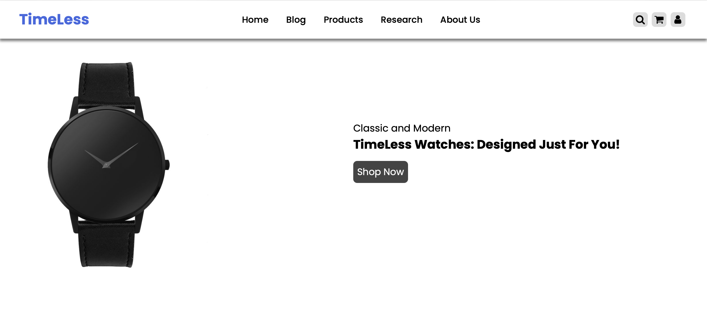
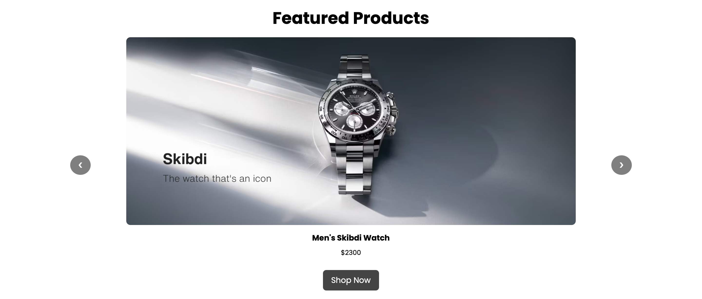
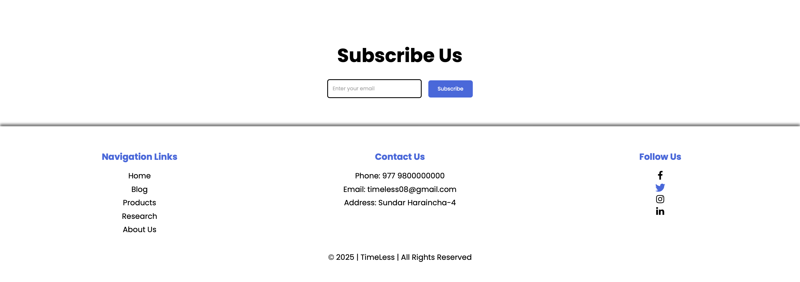
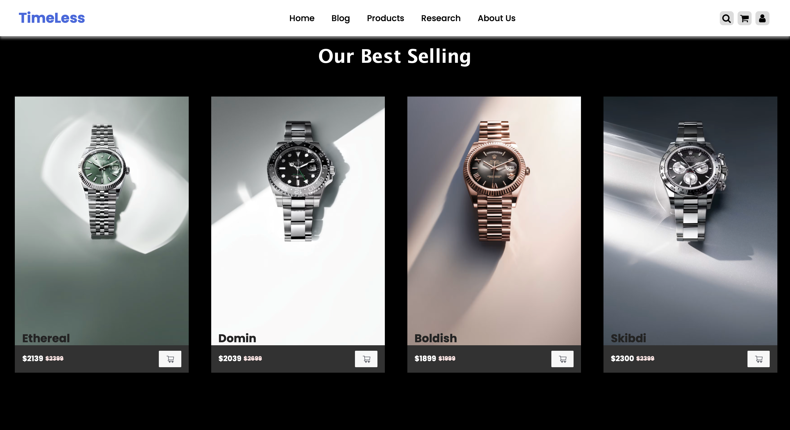
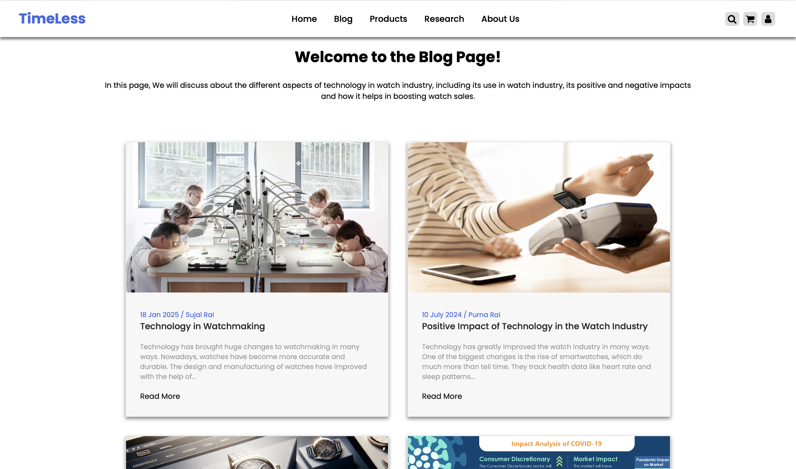
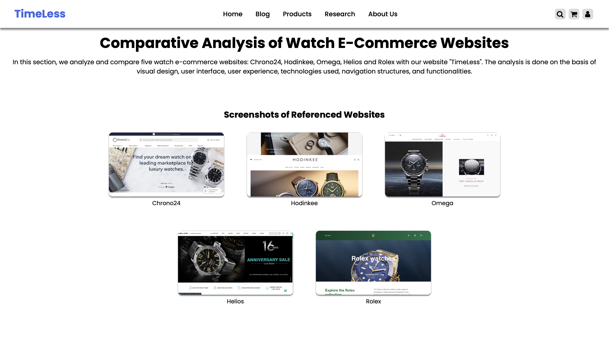
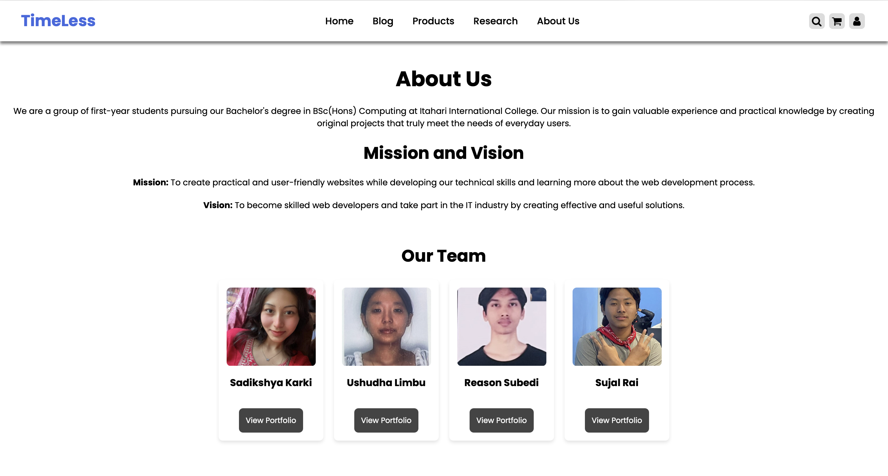

# ⌚ TimeLess Watch Store

## 📌 Overview

**TimeLess** is a custom-designed watch e-commerce website built to provide a modern and user-friendly platform for exploring and purchasing watches.  
It focuses on clean design, smooth navigation, and an intuitive browsing experience inspired by leading watch e-commerce platforms.

---

## 🚀 Features

- Responsive and modern UI design
- Horizontal navigation bar (Home, Blog, Products, Research, About Us)
- Search functionality with modal interface
- Login modal (email & password input)
- Research section with competitor analysis
- Screenshot gallery of referenced websites
- Comparison tables for different platforms
- Footer with navigation, contact info, and social media links

---

## 🛠️ Technologies Used

- **HTML5** – Structure and semantic markup  
- **CSS3** – Styling (internal & external stylesheets)  
- **JavaScript** – Interactivity (modals, search, etc.)  
- **Font Awesome** – Icons  
- **Balsamiq** – Wireframing and design planning  

---

## 📁 Project Structure

```
IS/
├── Code/
│   ├── blogImg/                  # Blog post images
│   │   ├── blog1.jpg
│   │   ├── blog2.jpg
│   │   ├── blog3.jpg
│   │   └── blog4.jpg
│   │
│   ├── CSS/                      # Stylesheets
│   │   ├── About Us.css
│   │   ├── blog-content.css
│   │   ├── blog.css
│   │   ├── headerFooter.css
│   │   ├── products.css
│   │   ├── research.css
│   │   └── Style.css
│   │
│   ├── icons/                    # Icon assets
│   │   └── cart.png
│   │
│   ├── Image/                    # Product & team images
│   │   ├── Product 1.png
│   │   ├── Product 2.png
│   │   ├── Product 3.png
│   │   ├── Reason's Image.jpg
│   │   ├── Sadikshya's Image.jpg
│   │   ├── Sujal's Image.jpg
│   │   ├── Ushudha's Image.jpg
│   │   └── Watch.jpeg.jpg
│   │
│   ├── JS/                       # JavaScript files
│   │   ├── products.js
│   │   └── script.js
│   │
│   ├── newGridImage/             # Grid gallery images
│   │   ├── female1.jpg – female12.jpg
│   │   └── male1.jpg – male12.jpg
│   │
│   ├── ReferencedWebsites/       # Reference brand logos
│   │   ├── Chrono24.png
│   │   ├── Helios.png
│   │   ├── Hodinkee.png
│   │   ├── Omega.png
│   │   └── Rolex.png
│   │
│   ├── watches/                  # Watch product images
│   │   ├── male Boldish.png
│   │   ├── male Domin.png
│   │   ├── male Ethereal.png
│   │   ├── male Skibdi.png
│   │   ├── seamless female.png
│   │   ├── shine female.png
│   │   ├── sporty female.png
│   │   └── vintage female.png
│   │
│   ├── About Us.html
│   ├── blog.html
│   ├── blog1.html – blog4.html
│   ├── female.html
│   ├── home.html
│   ├── male.html
│   ├── research.html
│   └── Footer.html
│
├── previews/                     # Page preview screenshots
│   ├── AboutUsPage.png
│   ├── BlogPage.png
│   ├── FeaturedProducts.png
│   ├── Footer.png
│   ├── HomePage.png
│   ├── ProductPage.png
│   └── ResearchPage.png
│
└── README.md
```

---

## ▶️ How to Use

1. Clone or download this repository  
2. Open `home.html` in your browser  
3. Navigate using the menu:
   - Home
   - Blog
   - Products
   - Research
   - About Us  
4. Use the 🔍 search icon to find products or brands  
5. Use the 👤 login icon to open the login modal  

---

## ⚠️ Limitations

- No backend (static website)
- Login system is UI-only (not functional)
- No real product database or payment integration

---

## 📸 Preview









---

## 🧑‍💻 Author
**Sadikshya Karki**
